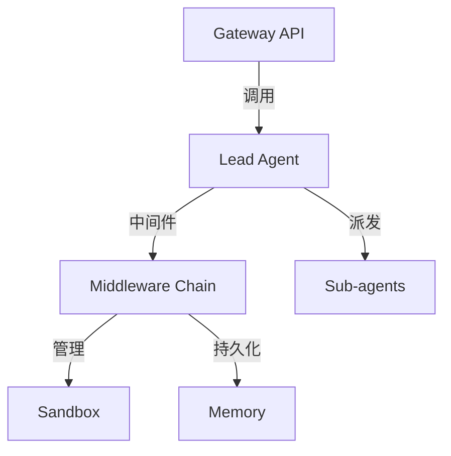

# DeerFlow 源码系统化学习指南

本指南由 AI 专家 Jules 生成，旨在帮助开发者深入理解字节跳动开源项目 DeerFlow 2.0 的核心架构、实现细节与工程实践。

---

## 目录
1. [项目概述与技术栈总结](#1-项目概述与技术栈总结)
2. [仓库目录结构详解](#2-仓库目录结构详解)
3. [高层次架构与执行流程](#3-高层次架构与执行流程)
4. [核心模块深度解析](#4-核心模块深度解析)
5. [关键代码文件 Walkthrough](#5-关键代码文件-walkthrough)
6. [配置、部署与运行机制](#6-配置部署与运行机制)
7. [扩展性设计与工程最佳实践](#7-扩展性设计与工程最佳实践)
8. [学习收益、潜在改进点与风险](#8-学习收益潜在改进点与风险)
9. [系统化学习路线图与实践任务](#9-系统化学习路线图与实践任务)

---

## 1. 项目概述与技术栈总结

### 1.1 项目目标
DeerFlow (Deep Exploration and Efficient Research Flow) 是一个高性能、可扩展的 **AI Agent Harness (智能体编排框架)**。它不再仅仅是一个预定义的 Research 工作流，而是一个为 Agent 提供基础设施（文件系统、记忆、沙箱、子代理调度、技能库）的**运行环境**。

### 1.2 核心特性
- **LangGraph 驱动**：利用有向无环图（DAG）及状态管理能力，实现复杂的 Agent 交互逻辑。
- **技能系统 (Skills)**：基于 Markdown 定义的技能描述，按需加载，节省 Token 消耗。
- **混合执行模式**：支持 Standard 模式（独立 LangGraph 服务）和 Gateway 模式（嵌入式运行）。

### 1.3 技术栈
- **语言**: Python 3.12+, TypeScript (Next.js 15)
- **框架**: LangGraph, LangChain, FastAPI
- **工具**: uv (Python 包管理), pnpm (Node.js 包管理)
- **沙箱**: Docker, Kubernetes, `agent-sandbox`

---

## 2. 仓库目录结构详解

```text
deer-flow/
├── backend/                # 后端核心代码
│   ├── app/                # 应用层 (Gateway, IM 渠道)
│   ├── packages/harness/   # 框架层 (DeerFlow 核心逻辑)
│   ├── tests/              # 测试用例
│   └── langgraph.json      # LangGraph 配置
├── frontend/               # 前端代码 (Next.js)
├── skills/                 # 技能库 (public/custom)
├── docker/                 # 容器化配置
└── scripts/                # 运维与启动脚本
```

**设计原理**: 采用 **Harness/App 隔离**。`harness` 是纯粹的 Agent 引擎，不依赖 `app` 的 Web 接口。

---

## 3. 高层次架构与执行流程

### 3.1 架构图


### 3.2 执行流程
1. **请求接入**: Gateway 接收任务并初始化 ThreadState。
2. **中间件拦截**: SandboxMiddleware 准备环境，MemoryMiddleware 加载上下文。
3. **推理循环**: Lead Agent 思考计划，必要时派发子任务给 Sub-agents。
4. **结果汇总**: 产物存入 `/mnt/user-data/outputs`，记忆异步更新。

---

## 4. 核心模块深度解析

- **LangGraph 编排**: 使用“单节点自循环”模式，依靠模型内生的决策能力。
- **记忆系统**: 异步事实提取 (Facts Extraction)，非向量 RAG，更易于人工干预。
- **沙箱机制**: 虚拟路径映射。Agent 看到的是 `/mnt/workspace`，物理对应 `.deer-flow/threads/{id}/workspace`。
- **子代理系统**: 通过 `task` 工具递归调用。后台线程池处理，Lead Agent 自动轮询状态。

---

## 5. 关键代码文件 Walkthrough

1. `agent.py`: Agent 组装工厂，定义中间件顺序。
2. `thread_state.py`: 状态机定义，包含自定义 Reducers。
3. `sandbox.py`: 虚拟文件操作的抽象层。
4. `updater.py`: 长期记忆提取逻辑，包含文件上传过滤。
5. `loader.py`: 技能动态扫描与启用逻辑。
6. `mcp/client.py`: 外部工具生态 (Model Context Protocol) 接入。
7. `app.py`: FastAPI Gateway 入口。
8. `client.py`: 嵌入式 SDK，支持无服务运行。

---

## 6. 配置、部署与运行机制

- **配置**: `config.yaml` 管理模型和工具，`extensions_config.json` 管理 MCP 和技能。
- **部署**:
  - `make dev`: 本地开发模式。
  - `make up`: Docker 生产部署（支持 DooD 沙箱）。
- **Gateway 模式**: 通过 `--gateway` 标志，将 Agent 运行时嵌入 Gateway，减少进程开销。

---

## 7. 扩展性设计与工程最佳实践

- **中间件模式**: 关注点分离，易于在推理链条中插入自定义逻辑（如安全审查）。
- **反射机制**: 使用 `resolve_variable` 从字符串路径加载插件，极大地降低了耦合度。
- **Provider 模式**: 沙箱和防护轨 (Guardrails) 均可插拔。

---

## 8. 学习收益、潜在改进点与风险

- **收益**: 掌握生产级 Agent 的状态管理、隔离执行和知识沉淀。
- **改进点**:
  - **异步化**: 目前部分 IO 仍为同步，可迁移至全异步。
  - **池化**: 沙箱容器池化以降低冷启动延迟。
- **风险**: `LocalSandbox` 的权限溢出风险及大规模 Sub-agent 带来的 Token 成本。

---

## 9. 系统化学习路线图与实践任务

- **入门**: 跑通 Demo，配置自定义模型。
- **进阶**: 开发一个 `.skill` 技能并使用自定义工具。
- **精通**: 实现自定义中间件，并尝试将系统迁移到全异步架构。

---
*指南生成于 2026-05-21*
