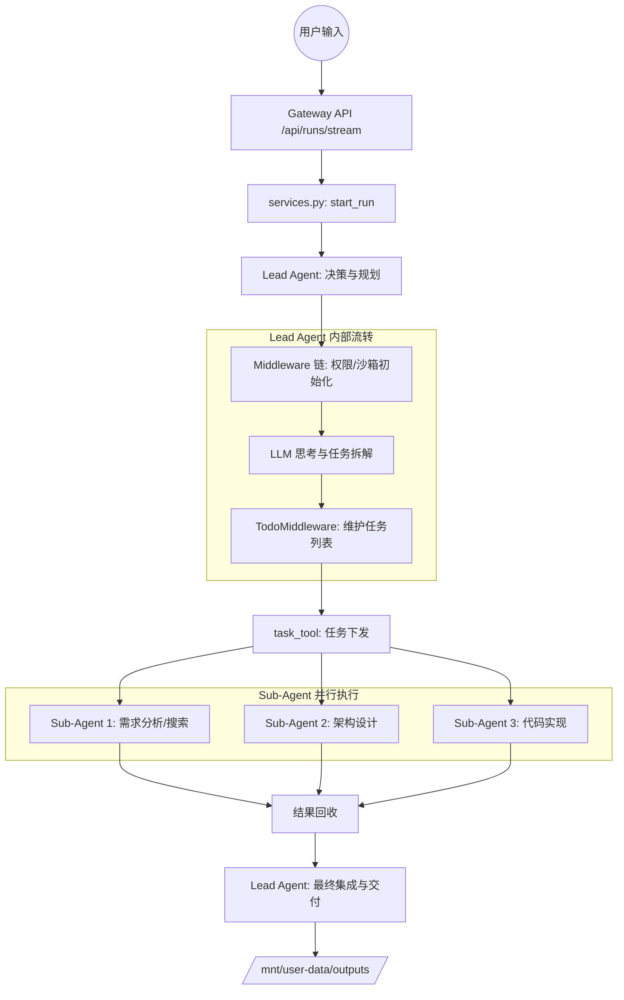

# DeerFlow 任务执行流程深度解析

本文将详细介绍在 DeerFlow 2.0 项目运行中，输入“为我开发一个完整的 AI 论文阅读与知识管理助手系统，并生成最终可直接部署的代码包。”这一复杂指令后，系统内部从 API 调用到多 Agent 协同完成任务的全流转过程。

## 1. 整体流程概览

系统采用 **Lead-Sub-Agent 架构**。Lead Agent 负责全局规划（Planning）、任务拆解（Decomposition）和最终结果合成（Synthesis）；Sub-Agent 负责具体的执行任务（如搜索、编码、文件操作）。

---

## 2. 详细流转步骤

### 第一阶段：API 入口与环境准备

1.  **入口函数**：`backend/app/gateway/routers/runs.py` 中的 `stateless_stream` 或 `stateless_wait`。
2.  **核心处理**：
    *   调用 `services.py` 中的 `start_run` 函数。
    *   **状态初始化**：创建 `RunRecord` 记录当前运行状态（Pending/Running）。
    *   **Agent 工厂**：调用 `resolve_agent_factory`（位于 `backend/packages/harness/deerflow/agents/lead_agent/agent.py` 的 `make_lead_agent`）。
3.  **配置注入**：
    *   `build_run_config` 函数会将用户选择的模式（如 `is_plan_mode=True`, `subagent_enabled=True`）注入到 `RunnableConfig` 的 `configurable` 字典中。

### 第二阶段：Lead Agent 状态机启动

1.  **状态机创建**：`make_lead_agent` 函数根据配置构建一个由 `langgraph` 驱动的状态机。
2.  **Middleware 链条（按顺序执行）**：
    *   **SandboxMiddleware**：初始化 Docker 或本地沙箱。状态记录在 `ThreadState["sandbox"]` 中。
    *   **UploadsMiddleware**：扫描 `/mnt/user-data/uploads`，将已上传的文件列表注入状态，方便 LLM 引用。
    *   **TodoMiddleware**：检测到 `is_plan_mode=True`，向系统提示词注入 `<todo_list_system>` 规则，并提供 `write_todos` 工具。
3.  **Prompt 动态合成**：
    *   调用 `prompt.py` 中的 `apply_prompt_template`。
    *   **Skill 动态加载**：系统通过 `get_skills_prompt_section` 扫描 `/skills` 目录。对于“开发系统”任务，系统会探测到相关的 coding/research skills，并在提示词中告知 Agent 使用 `read_file` 加载这些 Skill 的 `SKILL.md` 指南。

### 第三阶段：任务拆解与规划（Decomposition）

1.  **LLM 思考**：Lead Agent 接收到复杂需求后，进入 `thinking` 过程。
2.  **任务列表维护**：
    *   **动作**：LLM 调用 `write_todos` 工具。
    *   **函数**：`backend/packages/harness/deerflow/agents/middlewares/todo_middleware.py` 处理该调用。
    *   **状态记录**：任务被记录在 `ThreadState["todo_list"]` 中。例如：
        *   Task 1: 分析需求并制定技术栈（In Progress）
        *   Task 2: 设计系统架构与目录结构（Pending）
        *   Task 3: 编写核心逻辑代码（Pending）
        *   ...

### 第四阶段：多 Agent 编排与并行执行（Orchestration）

1.  **任务分发**：
    *   **工具**：`task_tool` (`backend/packages/harness/deerflow/tools/builtins/task_tool.py`)。
    *   **逻辑**：Lead Agent 发现 Task 1, 2, 3 可以并行或部分并行时，会发起多个 `task()` 工具调用。
2.  **Sub-Agent 启动**：
    *   `task_tool` 创建一个 `SubagentExecutor`。
    *   **函数**：`SubagentExecutor.execute_async` 在独立的线程/协程中启动一个新的 LangGraph 实例。
    *   **独立上下文**：Sub-Agent 拥有精简版的工具集和独立的 Context，专注于完成子任务。
3.  **状态监控**：
    *   Lead Agent 通过 `task_tool` 内部的轮询机制（`get_background_task_result`）监控子 Agent 的进度，并实时通过 SSE 向前端返回 `task_running` 事件。

### 第五阶段：结果合成与交付（Synthesis）

1.  **回收结果**：Sub-Agent 完成后，将结果（如生成的代码文件路径或设计文档）返回给 Lead Agent。
2.  **文件呈现**：
    *   **函数**：`present_file_tool.py`。
    *   **逻辑**：Lead Agent 将最终生成的代码包（如 `.zip` 或 目录）放入 `/mnt/user-data/outputs/`，并调用该工具告知用户。
3.  **内存沉淀**：
    *   **Middleware**：`MemoryMiddleware`。
    *   **逻辑**：任务完成后，提取本次交互中的关键信息（如用户的偏好、系统架构选择）存入长期内存，以便下次使用。

---

## 3. 核心代码、函数与状态流转

下表详细列出了任务执行过程中涉及的关键代码路径及函数作用：

### 3.1 关键函数清单

| 阶段 | 文件路径 | 函数/类名 | 详细作用 | 记录状态 |
| :--- | :--- | :--- | :--- | :--- |
| **请求分发** | `backend/app/gateway/routers/runs.py` | `stateless_stream` | 接收 HTTP POST 请求，生成 `thread_id`，启动 SSE 流。 | `thread_id` |
| **流程启动** | `backend/app/gateway/services.py` | `start_run` | 初始化 `RunRecord`，调用 `run_agent` 启动异步任务。 | `RunStatus.running` |
| **Agent 创建** | `backend/packages/harness/deerflow/agents/lead_agent/agent.py` | `make_lead_agent` | 根据请求中的 `context`（如 `is_plan_mode`）组装模型、工具和中间件链。 | `configurable` |
| **沙箱准备** | `backend/packages/harness/deerflow/sandbox/middleware.py` | `SandboxMiddleware` | 在 Agent 运行前分配沙箱资源（Docker 容器或本地目录）。 | `ThreadState["sandbox"]` |
| **任务拆解** | `backend/packages/harness/deerflow/agents/middlewares/todo_middleware.py` | `TodoMiddleware` | 拦截 `write_todos` 调用，更新任务列表。 | `ThreadState["todo_list"]` |
| **Sub-Agent 分派** | `backend/packages/harness/deerflow/tools/builtins/task_tool.py` | `task_tool` | 接收 Lead Agent 指令，调用 SubagentExecutor。 | `task_id` |
| **并行执行** | `backend/packages/harness/deerflow/subagents/executor.py` | `SubagentExecutor` | 在独立线程池中运行 Sub-Agent，管理超时和结果回收。 | `SubagentStatus` |
| **Skill 加载** | `backend/packages/harness/deerflow/agents/lead_agent/prompt.py` | `get_skills_prompt_section` | 扫描 `skills/` 目录，将可用 Skill 的路径和描述注入 System Prompt。 | `available_skills` |
| **结果交付** | `backend/packages/harness/deerflow/tools/builtins/present_file_tool.py` | `present_file_tool` | 标记最终生成物路径（如代码包），以便前端展示下载。 | `ThreadState["artifacts"]` |

### 3.2 ThreadState 关键字段说明

在流转过程中，`ThreadState` 是核心数据结构，记录了任务的每一刻：

| 字段名 | 作用 |
| :--- | :--- |
| `messages` | 记录完整的对话历史，包括 Lead Agent 的思考、工具调用结果。 |
| `todo_list` | 记录任务拆解的列表、每个任务的状态（pending/in_progress/completed）。 |
| `sandbox` | 记录沙箱的 ID、运行环境配置、工作目录路径。 |
| `thread_data` | 跨请求持久化的数据，如项目名称、全局变量。 |
| `title` | 由 `TitleMiddleware` 自动生成的对话标题。 |
| `artifacts` | 记录生成交付物的路径。 |

### 3.3 演变轨迹示例

以本项目为例，`ThreadState` 的变化过程如下：

1.  **初始状态**：`{"messages": [HumanMessage("为我开发...")], "sandbox": None, "todo_list": []}`
2.  **Middleware 执行后**：`sandbox` 字段被填充为具体的容器 ID 或本地路径。
3.  **LLM 首次响应后**：`todo_list` 填充了拆解后的子任务；`messages` 增加了一条 AIMessage 包含 `write_todos` 调用。
4.  **Sub-Agent 运行中**：`messages` 增加多条 ToolMessage，记录 `task_tool` 的返回结果。
5.  **任务完成后**：`todo_list` 所有项变为 `completed`；`artifacts` 记录了 `/mnt/user-data/outputs/system_code_v1.zip`。

---

## 4. 关键机制详解

### 4.1 如何拆解任务 (Planning)
当 `is_plan_mode=True` 时，系统启用 `TodoMiddleware`。
- **原理**：通过在 System Prompt 中注入强制性的“任务清单管理规则”，要求 LLM 在处理复杂请求前必须先调用 `write_todos`。
- **流转**：LLM 发出 `write_todos` -> Middleware 捕获并修改 `ThreadState["todo_list"]` -> 结果返回给 LLM 继续下一步。

### 4.2 如何编排 Agent (Orchestration)
当 `subagent_enabled=True` 时，系统启用 `task` 工具。
- **并行策略**：Lead Agent 在思考后，可以在一个响应中发出多个 `task()` 调用。
- **并发控制**：`SubagentLimitMiddleware` 强制执行 `MAX_CONCURRENT_SUBAGENTS`（默认 3），防止 Token 爆炸或资源耗尽。
- **隔离性**：每个 Sub-Agent 运行在 `executor.py` 创建的独立线程池中，拥有自己的 `langgraph` 环境，避免了主对话上下文过长。

### 4.3 如何加载 Skill
- **发现**：`skills/` 目录下的每个文件夹只要包含 `SKILL.md` 就会被识别。
- **注入**：`get_skills_prompt_section` 函数动态读取这些 Skill 的名称和描述，生成 XML 格式的 `<available_skills>` 列表放入 Lead Agent 的系统提示词中。
- **按需读取**：Agent 在思考过程中，如果认为需要某个 Skill，会自主决定调用 `read_file` 去读取具体的 `SKILL.md` 内容。

---

## 5. 总结：系统如何处理您的特定请求？

1.  **输入**：“为我开发论文阅读助手...”
2.  **流转**：
    *   **识别**：Lead Agent 识别出这是一个高复杂度任务。
    *   **加载**：加载 `coding` 和 `research` 的 Skill 以获取专业流程指导。
    *   **拆解**：使用 `write_todos` 规划出：1. 调研竞品 -> 2. 设计后端 API -> 3. 实现前端 UI -> 4. 打包。
    *   **并行**：启动多个 Sub-Agent 并行进行调研和 API 设计。
    *   **执行**：在 Docker 沙箱中真实创建文件目录，编写 `.py`, `.ts` 等文件。
    *   **完成**：将所有文件压缩，调用 `present_file` 给出下载链接。
